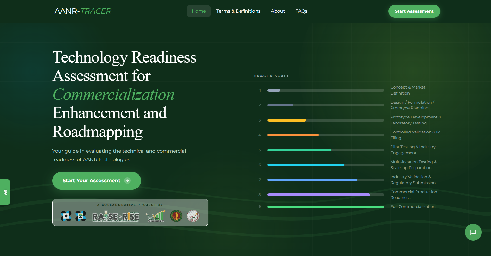

# AANR-TRACER

**AANR Technology Readiness Assessment for Commercialization and Evaluation Report**

> Developed by DOST-PCAARRD, RAISE Western Visayas, and UPV TTBDO

---



---

## Overview

**AANR-TRACER** is a web-based assessment platform that evaluates the **Technology Readiness Level (TRL)** of innovations in the **Agriculture, Aquatic, and Natural Resources (AANR)** sector.

The platform applies a structured, multi-step questionnaire and generates **evidence-based, AI-powered recommendations** to support the progression of technologies from research and development toward adoption and commercialization.

Technologies are evaluated across five categories:

- Technology Status
- Market and Commercialization Status
- Intellectual Property Protection Status
- Industry Adoption Status
- Regulatory Compliance Status

This supports:

- Standardized TRL evaluation across the AANR sector
- Informed decision-making for researchers and technology managers
- Strategic planning across stages of technology maturation
- Formal PDF reporting for documentation and funding decisions

---

## Assessment flow

Users are guided through a fixed sequence of steps. Each step must be completed before proceeding — no steps can be skipped.
```
Disclaimer → Data Privacy → Technology Name → Technology Type
→ Description → Funding Source → Questionnaire → Summary → Results
```

At the **Results** step, the platform outputs:
- An assigned **TRACER level** (1–9) based on the questionnaire responses
- **Insights** drawn from the assessment
- An **AI-generated recommendation** for progressing to the next level

Users may then optionally **download a PDF report** or **send it to an email address**.

For the full step-by-step breakdown, see [`docs/assessment-flow.md`](docs/assessment_flow.md).

---

## System architecture

AANR-TRACER is a stateless Next.js application — no database is used. All assessment responses are held in browser session storage for the duration of the session and cleared automatically on exit.

| Concern | Approach |
|---|---|
| Assessment scoring | Custom TRACER calculator running client-side (`trlCalculator.ts`) |
| AI recommendations | OpenAI GPT-4o mini via `/api/recommend` serverless route |
| PDF generation | `@react-pdf/renderer` compiled and streamed server-side |
| Email delivery | Nodemailer + Gmail SMTP via `/api/report` serverless route |
| State management | React Context API + `sessionStorage` — no server-side persistence |
| Hosting | Vercel (edge CDN + serverless functions) |

**Data flow in brief:**

1. User completes the assessment — responses saved to session storage at each step.
2. On submission, `trlCalculator.ts` runs client-side and computes the TRACER level.
3. Structured results are sent to `/api/recommend`, which calls GPT-4o mini and returns the AI recommendation.
4. Results, insights, and the recommendation are displayed on the results page.
5. Optionally, `/api/report` generates a PDF and delivers it via download or email.

For the full architecture diagram and component breakdown, see [`docs/architecture.md`](docs/architecture.md).

---

## Tech stack

| Layer | Technology |
|---|---|
| Framework | Next.js 14 (App Router) |
| Language | TypeScript |
| Styling | Tailwind CSS v3 |
| AI recommendations | OpenAI API (`gpt-4o-mini`) |
| PDF generation | `@react-pdf/renderer` |
| Email delivery | Nodemailer + Gmail OAuth2 |
| State management | React Context API + `sessionStorage` |
| Data | `questions.json` — structured question bank |

---

## Project structure
```
AANR-TRACER/
├── docs/                          # Project documentation
├── public/
│   ├── questions.csv              # TRL question bank
│   └── img/logos/                 # Brand assets
├── src/
│   ├── app/
│   │   ├── about/
│   │   ├── faq/
│   │   ├── terms/
│   │   ├── api/
│   │   │   └── recommend/         # OpenAI proxy route
│   │   ├── assessment/
│   │   │   ├── disclaimer/
│   │   │   ├── data-privacy/
│   │   │   ├── name/
│   │   │   ├── type/
│   │   │   ├── description/
│   │   │   ├── funding-source/
│   │   │   ├── questionnaire/
│   │   │   ├── summary/
│   │   │   ├── results/           # Results + AI recommendations
│   │   │   ├── AssessmentContext.tsx
│   │   │   └── layout.tsx
│   │   ├── layout.tsx
│   │   └── page.tsx
│   ├── components/
│   │   ├── Header.tsx
│   │   └── Footer.tsx
│   └── utils/
│       ├── trlCalculator.ts
│       ├── helperConstants.ts
│       ├── ipHelpers.ts
│       ├── levelsDescription.ts
│       ├── faqUtils.ts
│       └── termsUtils.ts
├── CHANGELOG.md
├── README.md
├── package.json
└── next.config.ts
```

---

## Documentation

Full technical documentation is available in [`docs/`](docs/).

---

## Changelog

Version history is available in [`CHANGELOG.md`](CHANGELOG.md).