# Architecture

## System Components

### Frontend (Next.js Application)
- Multi-step assessment interface built with React and Tailwind CSS
- Form-based readiness evaluation across defined TRL categories
- Visualization of TRL scores, gaps, and recommendations

### Assessment Logic
- Rule-based evaluation of readiness criteria per technology type
- Pagination and category grouping of assessment questions
- Mapping of answers to TRL levels via `trlCalculator`

### Recommendation Engine
- Converts assessment outputs into structured prompts
- Generates contextualized guidance using AI models

### AI Services (OpenAI)
- Natural language generation for recommendations
- Ensures consistent tone and explainability
- Accessed via `/api/assistant` and `/api/recommend` routes

## Data Flow

1. The user completes a multi-step TRL assessment via the Next.js frontend.
2. Assessment state is managed in `AssessmentContext` across steps.
3. Assessment logic evaluates readiness across defined categories.
4. Results are mapped to a TRL level and supporting indicators via `trlCalculator`.
5. Structured prompts are sent to the AI service via API routes.
6. Generated recommendations are returned and displayed on the results page.

## Assessment Pipeline

The assessment pipeline consists of:
- Criteria-based evaluation for each readiness dimension
- Category and page grouping of questions by technology type
- Identification of maturity gaps across TRL levels
- Translation of gaps into recommendation prompts

Recommendations are indicative and designed to support decision-making,
not replace expert review.

## AI Integration

TRACER integrates AI language models to generate context-aware recommendations
via server-side API routes.

The AI component:
- Does not determine TRL scores
- Operates only on structured assessment outputs
- Produces narrative guidance aligned with predefined frameworks
- Does not retain user data beyond request processing