# Assessment flow

The website guides users through a series of pages in a fixed order. Each section collects a piece of information before moving to the next. The user cannot skip steps — each must be completed before proceeding.

## Steps

### 1. Start assessment
The entry point of the assessment. The user initiates the process by clicking the start button on the homepage or dashboard.

---

### 2. Disclaimer
The user is presented with a disclaimer outlining the scope, limitations, and purpose of the assessment. The user must acknowledge and accept the disclaimer before continuing.

---

### 3. Data privacy notice
The system displays the data privacy notice in accordance with applicable data protection regulations. The user must provide explicit consent for their data to be collected and processed before proceeding.

---

### 4. Technology name
The user enters the name of the technology being assessed. This serves as the primary identifier throughout the assessment.

**Input:** Free-text field

---

### 5. Technology type
The user selects the classification or category of the technology from a predefined list of options.

**Input:** Dropdown or radio button selection

---

### 6. Technology description
The user provides a brief description of the technology, including its purpose, function, and intended use.

**Input:** Text area (short paragraph)

---

### 7. Funding source
The user identifies how the technology is funded. Only one option may be selected.

**Options:**
- Government
- Private
- Not funded

---

### 8. Questionnaire
The user answers a series of assessment questions related to the technology. Questions are presented sequentially. The user may review and edit previous answers before final submission.

**Note:** The user can navigate back to review flagged items before proceeding.

---

### 9. Summary
An editable summary of all responses is displayed for the user to review. The user must confirm the information is accurate before submitting.

---

### 10. Results
The system generates and displays the assessment results, which include:

- **Tracer level** — the readiness or maturity level assigned to the technology
- **Insights** — key observations and findings based on the responses
- **AI recommendation** — system-generated guidance and suggested next steps

---

### 11. Report generation *(optional)*
If the user chooses to generate a report, the system compiles the results, insights, and AI recommendations into a downloadable document. This step is optional and can be skipped.

---

### 12. End
The assessment is complete. The user may exit, return to the dashboard, or start a new assessment.